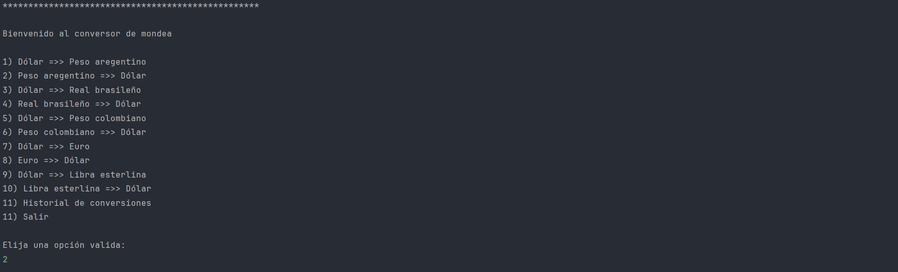
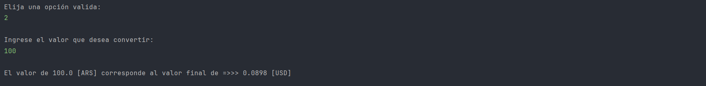
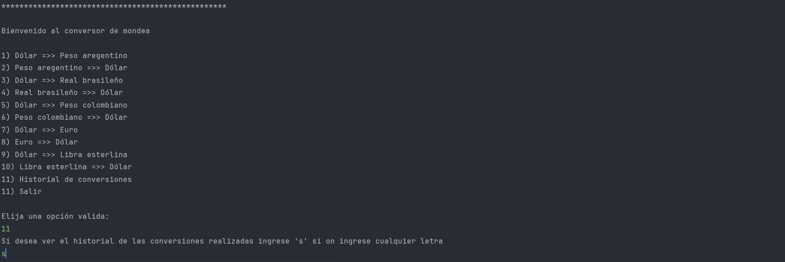
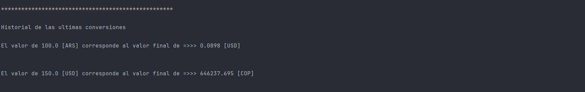

<h1>Challenge conversor de monedas</h1>

<h2>Descripción</h2> 

Este proyecto de consola muestra una seria de posibles conversiones entre monedas. Después de ingresar la conversión deseada, hay que ingresar el monto que se desea convertir. Luego se visualizará en consola el valor a convertir el valor convertido y los tipos de moneda, al final se podra visualizar el historial de las conversiones que se realizaron.

<h2> Características principales</h2>

- Convertir un cantidad de una modena a otra.
- Mostrar la conversion en consola.
- Mostral el historial de conversiones

<h2> Tecnologías utilizadas</h2>

- <strong>Java :</strong> Estructura del proyecto.

<h2> Instalación </h2>

1. Clonar el repositorio:
   ```sh
   git clone https://github.com/oscar1098/challenge-conversor-de-monedas.git
   ```

<h2> Uso</h2>

1. Ingrese el número de la conversión que desea realizar.

   

2. Ingrese el monto que desea convertir.

   

3. Si desea ver el historial de las conversiones ingrese "s".

   

   
   
